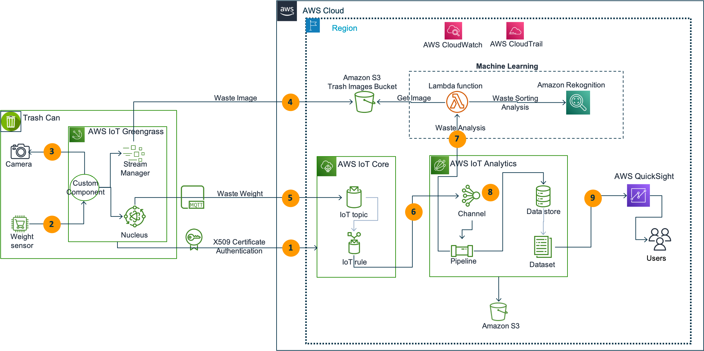

<h1 align="center">
AWS IoT Smart Wastebin solution
 
   
   
</h1>

This code builds a connected Trash Can IoT solution for local councils.
As the IoT use cases involve complex ecosystem of technologies right from sensor, device management
all the way through to analytics layer, the serverless architecture is a great way to start small, validate and
deploy at scale.

### Architecture

Target architecture:

  

## Security

See [CONTRIBUTING](CONTRIBUTING.md#security-issue-notifications) for more information.

## License

This library is licensed under the MIT-0 License. See the LICENSE file.
